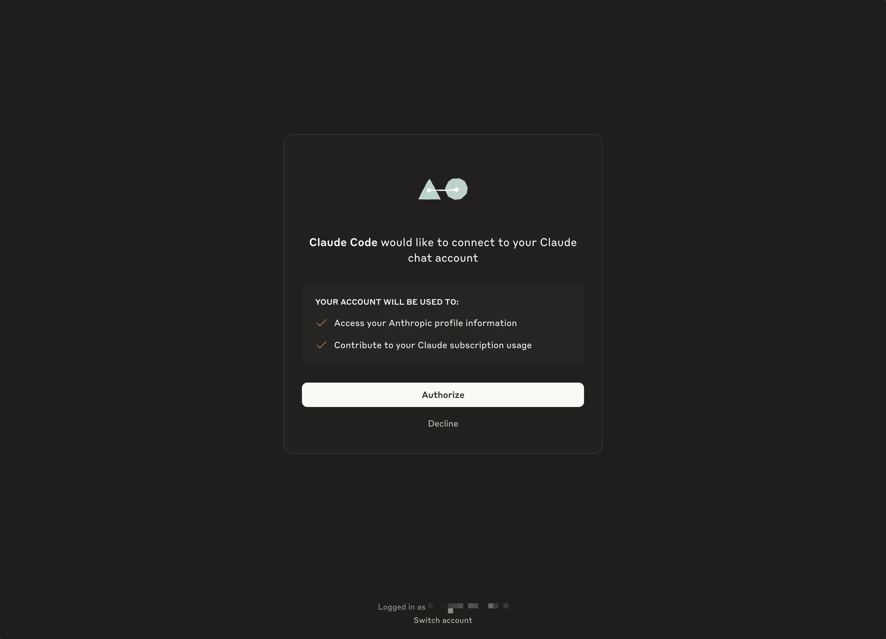
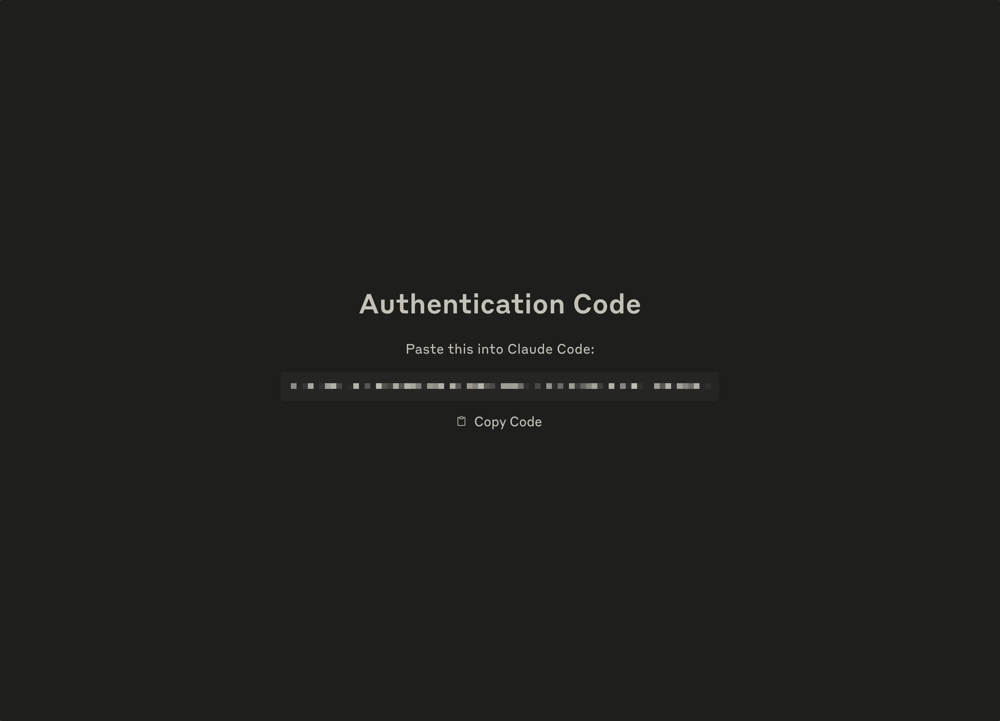
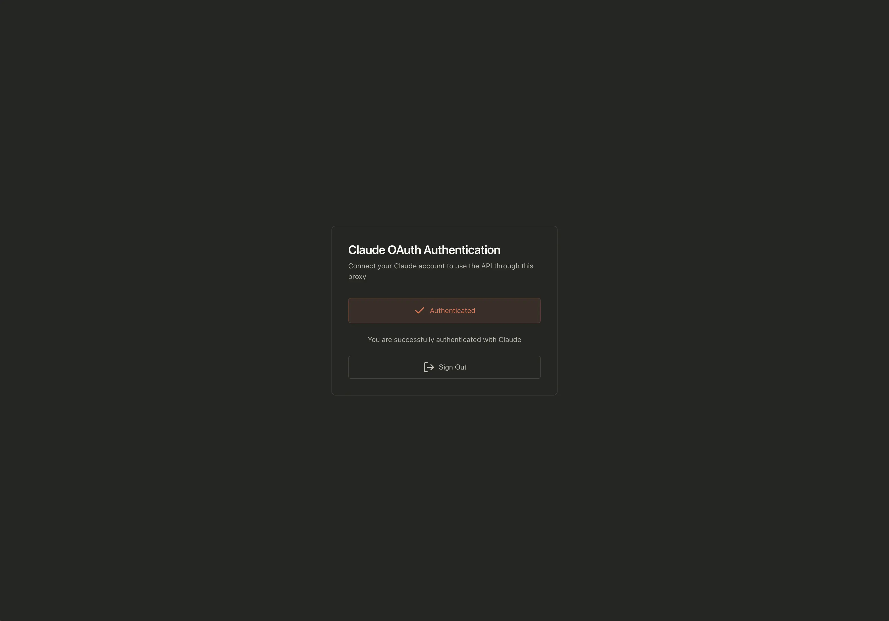
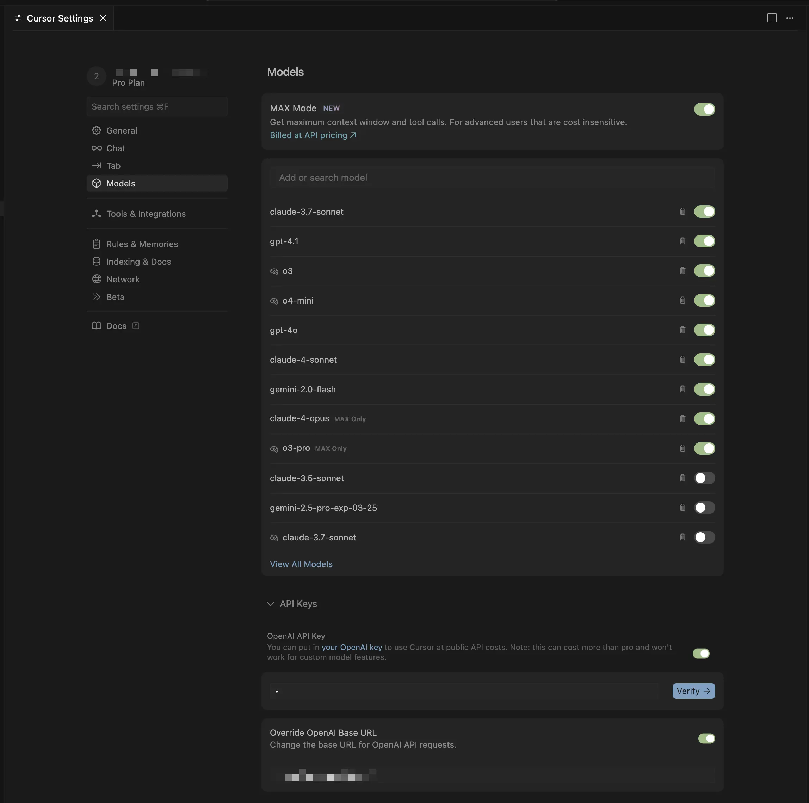

# 🚀 Deployment Guide - Cursor Claude Connector

This guide will help you connect Cursor with your Claude subscription using this proxy.

## 📋 Prerequisites

1. **Active Claude subscription** (Pro or Max)
2. **Cursor IDE** installed on your local machine
3. **GitHub account** (for Vercel deployment)

## 🚀 Deployment Options

### Option 1: Deploy to Vercel (Recommended) ⚡

The easiest way to get started is with our one-click Vercel deployment:

[](https://vercel.com/new/clone?repository-url=https://github.com/Maol-1997/cursor-claude-connector&integration-ids=oac_V3R1GIpkoJorr6fqyiwdhl17)

#### What happens when you click:

1. **Fork the repository** - Vercel will create a copy in your GitHub account
2. **Create Upstash Redis** - Automatically provisions a free Redis database
3. **Configure environment** - All variables are set up automatically
4. **Deploy the app** - Your proxy will be live in under 2 minutes!

#### After deployment:

1. Note your deployment URL (e.g., `https://your-app-name.vercel.app`)
2. Visit `https://your-app-name.vercel.app/` to authenticate with Claude
3. Configure Cursor with: `https://your-app-name.vercel.app/v1`

### Option 2: Manual Server Deployment

If you prefer to deploy on your own server:

#### 1. Install Bun

```bash
# Install Bun
curl -fsSL https://bun.sh/install | bash
source ~/.bashrc
```

#### 2. Clone and configure

```bash
# Clone the repository
git clone https://github.com/Maol-1997/cursor-claude-connector.git
cd cursor-claude-connector

# Set up environment variables
cp env.example .env
# Edit .env with your Upstash Redis credentials
```

#### 3. Set up Upstash Redis

1. Create a free account at [Upstash Console](https://console.upstash.com/)
2. Create a new Redis database
3. Copy the REST URL and REST Token to your `.env` file

#### 4. Start the server

```bash
# Run the start script (default port: 9095)
./start.sh

# Or with a custom port:
PORT=3000 ./start.sh
```

The script will:

- Install dependencies automatically
- Build the project
- Start the server on your specified port

## 🔐 Claude Authentication

### 1. Access the web interface

Open your browser and navigate to:

```
http://your-server-ip:9095/
```

Or if using a custom port:

```
http://your-server-ip:YOUR_PORT/
```


### 2. Authentication process

1. Click **"Connect with Claude"**

   

2. A Claude window will open for authentication
3. Sign in with your Claude account (Pro/Max)
4. Authorize the application

   

5. You'll be redirected to a page with a code
6. Copy the ENTIRE code (it includes a # in the middle)
7. Paste it in the web interface field
8. Click **"Submit Code"**

### 3. Verify authentication

If everything went well, you'll see the message: **"You are successfully authenticated with Claude"**



## 🖥️ Cursor Configuration

### 1. Open Cursor settings

1. In Cursor, press `Cmd+,` (Mac) or `Ctrl+,` (Windows/Linux)
2. Go to the **"Models"** section
3. Look for the **"Override OpenAI Base URL"** option

### 2. Configure the endpoint

1. Enable **"Override OpenAI Base URL"**
2. In the URL field, enter:

   **For Vercel deployment:**

   ```
   https://your-app-name.vercel.app/v1
   ```

   **For manual server deployment:**

   ```
   http://your-server-ip:9095/v1
   ```

   Examples:

   ```
   https://cursor-claude-proxy.vercel.app/v1
   http://54.123.45.67:9095/v1
   ```



### 3. Verify the connection

1. In the models list, you should see the available Claude models

2. Select your preferred model

3. Try typing something in Cursor's chat

## ✅ That's it!

You're now using Claude's full power directly in Cursor IDE. The proxy will handle all the communication between Cursor and Claude using your subscription.

## 🔍 Quick Troubleshooting

- **Can't connect?** Make sure the server is running (check the terminal where you ran `./start.sh`)
- **Authentication failed?** Try visiting `http://your-server-ip:PORT/auth/logout` and authenticate again
- **Models not showing?** Restart Cursor and make sure the URL ends with `/v1`
- **Using custom port?** Make sure to use the same port in both the server and Cursor configuration

---

Enjoy coding with Claude in Cursor! 🎉
