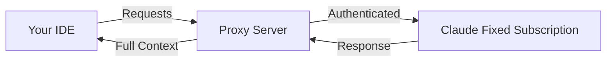

# 🚀 Cursor-Claude Connector

> **Maximize your Claude subscription**: Use Claude's full power in your favorite IDE (like Cursor)

## 🚀 Why use your Claude subscription in an IDE?

Get the best of both worlds by combining Claude's capabilities with a professional development environment:

### 💡 **Claude's Full Capabilities**

- Direct access to Claude's latest models and features
- No token limits from your Claude Max subscription
- Full context understanding without compression
- Handle large files and complex projects seamlessly

### 🛠️ **Professional IDE Experience**

- **Code-first interface**: Built specifically for development workflows
- **File management**: Navigate and edit multiple files effortlessly
- **Version control**: Full git integration and change tracking
- **Extensions & tools**: Access to your IDE's ecosystem

### 💰 **Maximize Your Investment**

- Already paying for Claude Max? Use it everywhere
- No additional API costs or usage limits
- One subscription, multiple environments
- Full value from your Claude subscription

### 🎯 **Perfect for Complex Projects**

- Maintain context across entire codebases
- Work with large files without restrictions
- Extended coding sessions without interruptions
- Professional development workflow

## ⚠️ **Important: Cursor Requirements**

> **Note**: Cursor requires at least the $20/month plan to use agent mode with custom API keys (BYOK - Bring Your Own Key). The free tier only supports basic completions.

## 🔧 How does this project work?

This proxy enables you to use your Claude Max subscription directly in IDEs that support OpenAI-compatible APIs:

- ✅ Your favorite IDE's interface and features
- ✅ Claude's full capabilities from your subscription
- ✅ No additional costs beyond your Claude Max subscription

### Architecture



## 🚀 Quick Installation

### 🔥 One-Click Deploy to Vercel

Deploy instantly with Upstash Redis integration:

[](https://vercel.com/new/clone?repository-url=https://github.com/Maol-1997/cursor-claude-connector&env=API_KEY&envDescription=Custom%20optional%20key%20for%20enhanced%20security%20protection&envLink=https://github.com/Maol-1997/cursor-claude-connector%23api-key&integration-ids=oac_V3R1GIpkoJorr6fqyiwdhl17)

<!-- The integration-ids parameter includes Upstash's official Vercel integration ID for automatic Redis setup -->

This will:

- ✅ Deploy the proxy to Vercel
- ✅ Automatically create an Upstash Redis database
- ✅ Configure all environment variables (including optional API_KEY)
- ✅ Get you running in under 2 minutes!

### 📖 Manual Setup Guide

For detailed instructions or alternative deployment methods, see our **[Deployment Guide](DEPLOYMENT.md)**.

### Local Development

1. **Clone the repository**

   ```bash
   git clone https://github.com/Maol-1997/cursor-claude-connector.git
   cd cursor-claude-connector
   ```

2. **Set up Upstash Redis**

   - Create a free Redis database at [Upstash Console](https://console.upstash.com/)
   - Copy your REST URL and REST Token
   - Copy `env.example` to `.env` and update with your values:

   ```bash
   cp env.example .env
   # Edit .env with your Upstash credentials
   ```

3. **Run the start script**

   ```bash
   ./start.sh
   ```

4. **Authenticate with Claude**

   - Open `http://localhost:9095/` in your browser
   - Follow the authentication process

5. **Configure Cursor**
   - Go to Settings → Models
   - Enable "Override OpenAI Base URL"
   - Enter: `http://localhost:9095/v1` (for local) or `https://your-app.vercel.app/v1` (for Vercel)
   - If you set an API_KEY during deployment, add it to your API key field in Cursor

## 🎉 Advantages of this solution

| Feature                 | Claude Web | Claude Code | **This Project**        |
| ----------------------- | ---------- | ----------- | ----------------------- |
| IDE Integration         | ❌         | ❌ Terminal | ✅ Full IDE             |
| File Management         | ❌         | ✅          | ✅ IDE Native           |
| Claude Max Usage Limits | ✅         | ✅          | ✅ No Additional Limits |
| Version Control         | ❌         | ⚠️          | ✅ Full Git Integration |
| Development Extensions  | ❌         | ❌          | ✅ IDE Ecosystem        |
| Cost                    | Claude Max | Claude Max  | Claude Max Only         |

## 🔐 API Key (Optional)

You can optionally set an `API_KEY` environment variable for additional security:

- If set, Cursor must provide this key in the API key field
- Adds an extra layer of authentication to your proxy
- Useful when deploying to public URLs
- Leave empty to use without additional authentication

## 🛡️ Security

- Uses your existing Claude session for authentication
- Optional API key for additional security
- Local connection between Cursor and the proxy
- Open source code for auditing

## 🤝 Contributions

Contributions are welcome! If you find any issues or have suggestions, please open an issue or PR.

## 📄 License

MIT - Use this project however you want

---

**Note**: This project is not affiliated with Anthropic or Cursor. It's a community tool to improve the development experience.
